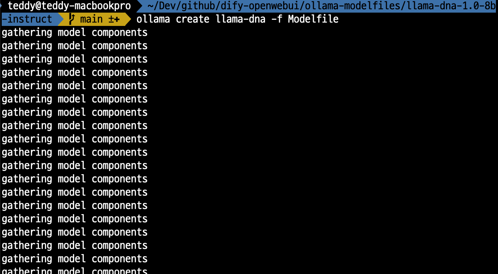
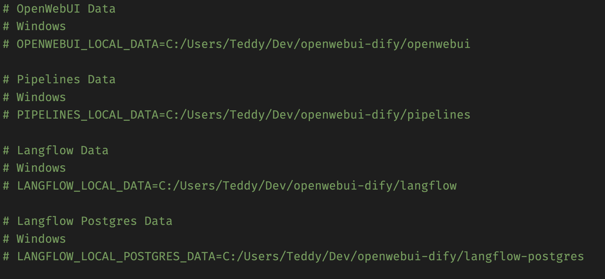
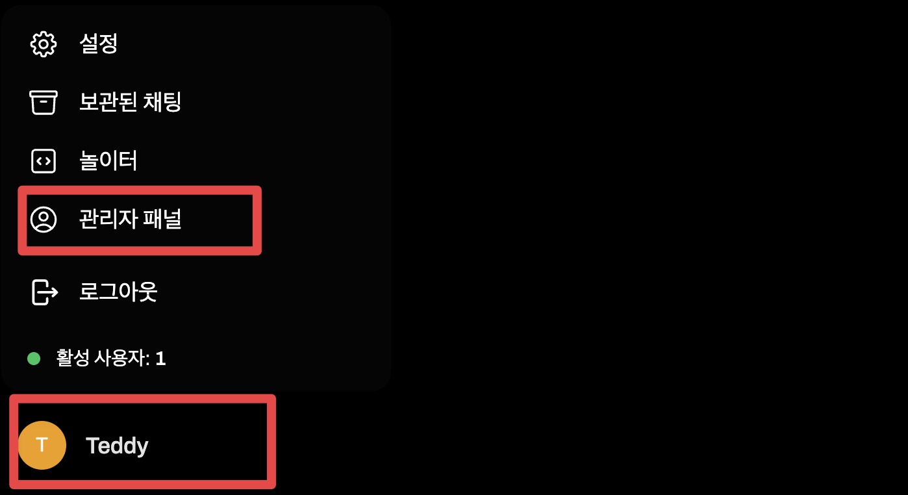
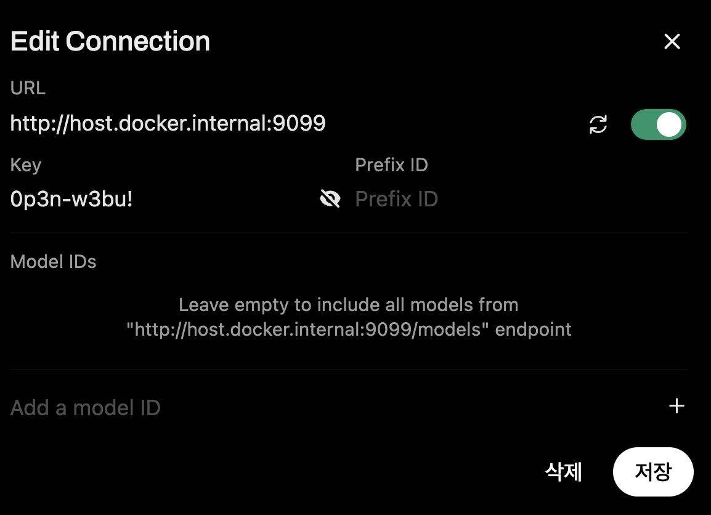
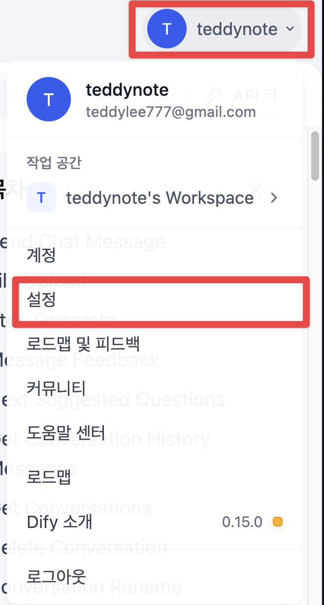
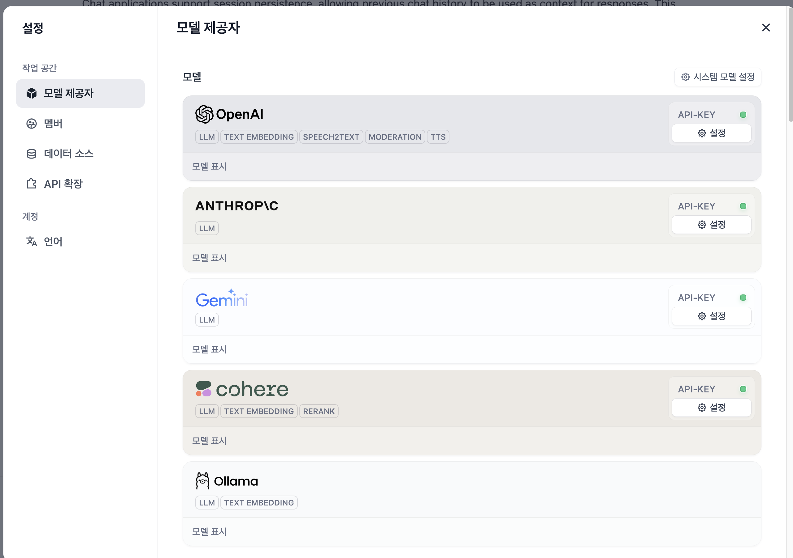

# Dify + OpenWebUI 설치 가이드

- 웹 버전 문서 링크: https://share.note.sx/de8qf4km#LizNfG6jf3B7f41LJgdLUhT/56AMGKC0tQGAebfRIK0

## Docker Desktop 설치

링크: https://www.docker.com/get-started/

Download Docker Desktop 을 내려받아 설치합니다.

docker desktop 의 dashboard 를 실행하여 잘 설치되었는지 확인합니다.

Mac 에서는 상단의 icon 을 클릭 후 go to dashboard 를 클릭하면 됩니다.

## Ollama 다운로드 및 설치

- 다운로드 링크: https://ollama.com/download

### 실습에 활용할 임베딩 모델

터미널을 열어주세요

`ollama list` 명령어를 입력하면 현재 설치된 모델 리스트가 뜹니다.
(아직 설치한 적이 없다면 아무것도 안뜨는 것이 정상입니다)

다음의 명령어를 입력하여 `bge-m3` 임베딩 모델을 다운로드 받습니다.

> 명령어 

`ollama pull bge-m3`

설치 후 `ollama list` 입력시 다음과 같이 `bge-m3:latest` 모델을 확인할 수 있습니다.

### 실습에 활용할 모델

Llama DNA 1.0 (8B) 모델
- 링크: https://huggingface.co/QuantFactory/Llama-DNA-1.0-8B-Instruct-GGUF/tree/main

양자화 수준을 보시고 구동이 가능한 모델을 **다운로드** 해주세요

다운로드 받은 `.gguf` 확장자를 가지는 모델은 Modelfile 의 동일 경로에 위치해 주세요

터미널을 열고 명령어를 실행하여 Ollama 모델을 생성하세요

먼저 터미널에서 경로를 이동합니다.

> 경로 이동

`cd ollama-modelfiles/llama-dna-1.0-8b-instruct`

다음으로는 `Modelfile` 을 열어 본인이 받은 `.gguf` 파일의 이름과 맞는지 확인합니다. (Q8, Q6, etc...)

같은 위치에 파일도 있어야 합니다.

다음의 명령어를 입력하여 모델 파일을 생성합니다.

> 모델 생성 명령어

`ollama create llama-dna -f Modelfile`

생성된 모델을 확인합니다.

`ollama run llama-dna`

> 실행 예시

구동이 잘 되는지 확인하였으면 `/bye` 를 입력하여 종료합니다.

## Git 다운로드 및 설치
### MacOS / Linux

Git 설치가 처음이신 분들은 아래 영상 링크를 참고해 주세요.

- 영상: https://youtu.be/mVu6Wj8Z7C0?si=Fh1Eu6j9q9IcXnaE&t=1311
- brew ~ git 설치까지 진행하시면 됩니다.
- 설치 메뉴얼: https://teddynote.com/10-RAG%EB%B9%84%EB%B2%95%EB%85%B8%ED%8A%B8/%ED%99%98%EA%B2%BD%20%EC%84%A4%EC%A0%95%20(Mac)/
### Windows

Git 설치가 처음이신 분들은 아래 영상 링크를 참고해 주세요.
- 영상: https://youtu.be/mVu6Wj8Z7C0?si=Wr-CUNF0D8XY12yM&t=585
- 설치 메뉴얼: https://teddynote.com/10-RAG%EB%B9%84%EB%B2%95%EB%85%B8%ED%8A%B8/%ED%99%98%EA%B2%BD%20%EC%84%A4%EC%A0%95%20(Windows)/

## 프로젝트 파일 다운로드

터미널을 열어 주세요
- 참고: Windows 유저는 Powershell 로 진행합니다.

`cd 프로젝트 파일을 다운로드 받을 경로`  로 먼저 경로를 이동합니다.

명령어 예시

> 도큐먼트 폴더에 다운로드 받는 경우

`cd ~/Documents`

git 명령어를 실행하여 프로젝트 파일을 다운로드 받습니다.

## .env 설정

`.env.teddynote` 파일의 이름을 `.env` 로 변경합니다.

`.env` 파일의 최하단으로 내려 데이터의 저장 경로를 지정합니다.
자신의 PC 에 새로운 폴더를 만들어 지정하시는 것을 추천 드립니다.

Mac / Window 별로 경로 지정 방식이 다를 수 있습니다.
둘 중 하나를 설정하고 안쓰는 경로는 주석(`#`) 처리합니다.

> Mac / Linux 예시

> Windows 예시

## Docker 컨테이너 실행

터미널을 열고 다음의 파일 위치로 이동 합니다.

`docker-compose-teddynote.yaml` 

다음의 명령어를 실행하여 도커 컨테이너를 구동합니다. 

> 도커 컨테이너 실행 명령어

`docker-compose -f docker-compose-teddynote.yaml up -d`

> 실행되는 모습

만약 실행되고 있는 컨테이너를 중지하는 경우 다음의 명령어를 입력하여 종료 할 수 있습니다.

> 컨테이너 실행 중지 명령어

`docker stop $(docker ps -q) && docker rm $(docker ps -aq)`

혹은 Docker Desktop 에서 "Containers" 메뉴에서 전체 선택 후 "Delete" 로 삭제할 수 있습니다.

## OpenWebUI 설정

OpenWebUI 로 접속합니다.

주소: http://localhost:3000/

계정을 새로 만들고 진행합니다.

상단에 만들어 놓은 `llama-dna:latest` 를 선택한 뒤 채팅을 입력하여 잘 동작하는지 확인합니다.

> 실행 예시

왼쪽 하단에 계정 클릭 - 관리자 패널을 선택합니다.

**설정** - **연결** 을 클릭합니다.

`OpenAI API` 섹션의 오른쪽 + 버튼을 눌러 다음을 추가 합니다.

- URL: `http://host.docker.internal:9099`
- Key: `0p3n-w3bu!`

이번에는 **설정** - **파이프라인** 에서 제공해 드린 `dify_pipeline_local.py` 파일을 업로드 합니다.

- (참고) 패스트캠퍼스 RAG 비법노트 강의실 - 강의자료 다운로드 후 파일을 확인할 수 있습니다.

업로드 한 뒤 아래 설정 파일이 잘 뜨는지 확인합니다.

## Dify 접속

링크: http://localhost/apps

접속하여 워크플로우 화면으로 이동합니다.

아직 워크플로우가 비어 있지만. 제공해드린 워크플로우 DSL 파일을 import 하여 테스트 가능합니다.

왼쪽 메뉴에서 "DSL 파일 가져오기" 메뉴을 클릭합니다.

제공해드린 테스트용 파일을 import 합니다 (테디노트 챗봇.yml)

잘 가져와지는지 테스트해 볼 수 있습니다.

미리 사용할 상용 모델들의 API 키를 셋팅해 두는 것이 좋습니다.

우측 상단 **계정** - **설정** 에서

왼쪽 "모델 제공자" 를 클릭하여 "설정" 에 API 키를 설정해 둡니다.

그럼 흐름을 구성할 때 설정된 키로 적용이 가능합니다.

