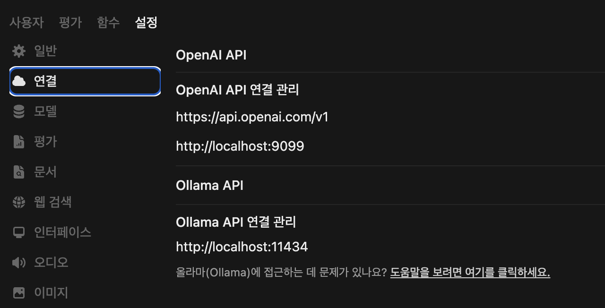
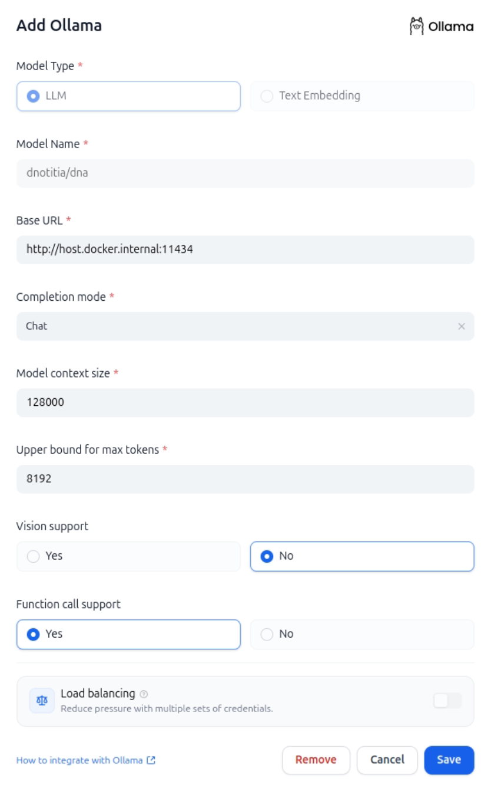
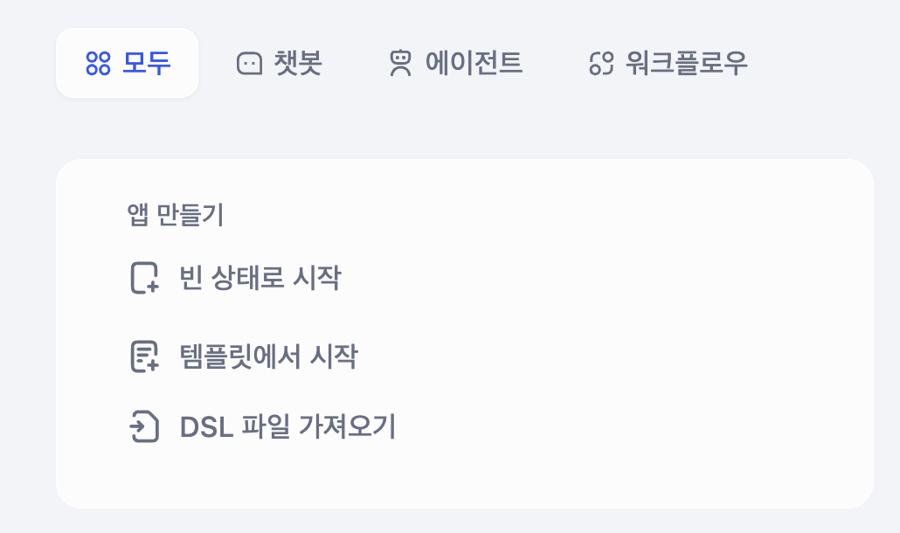
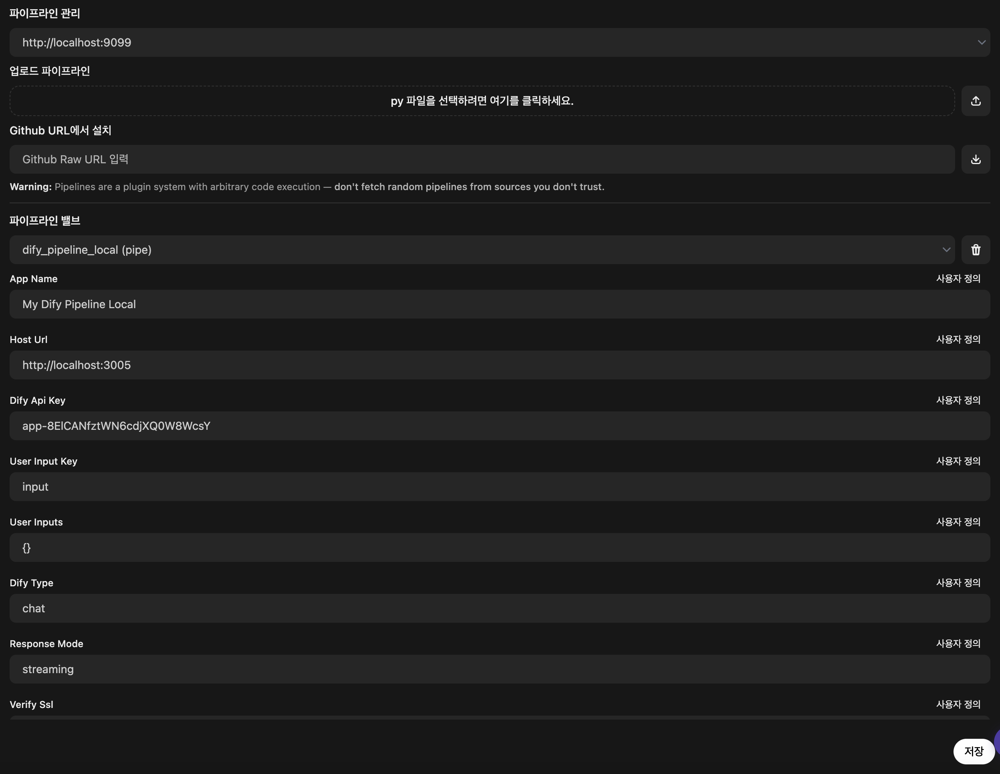

# Ubuntu에서 Dify 및 Ollama 설치 및 실행 가이드

이 가이드는 Ubuntu 24.04 환경에서 Dify 및 Ollama를 설치하고 실행하는 방법을 단계별로 설명합니다.

**Mac/Windows 설치 가이드** 는 [여기](README.md) 문서를 참고해 주세요.

---

## 1. 환경 준비

- **운영체제**: Ubuntu 24.04  
- **필수 포트**:
  - 3005: Dify API
  - 8080: OpenWebUI
  - 11434: Ollama API
  - 9099: OpenWebUI Pipeline

> [!info] 설치 전 시스템이 위 요구 조건을 충족하는지 확인하시기 바랍니다.

---

## 2. Ollama 설치 및 모델 설정

### 2.1 Ollama 설치

터미널에서 아래 명령어를 실행하여 Ollama를 설치합니다.

```bash
curl -fsSL https://ollama.com/install.sh | sh
```

### 2.2 모델 다운로드 및 테스트

`dnotitia/dna` 모델을 다운로드한 후, 정상 동작 여부를 확인합니다.

```bash
# 모델 다운로드
ollama pull dnotitia/dna

# 모델 실행 확인
ollama run dnotitia/dna
```

### 2.3 Ollama Service 중지

Ollama가 도커 컨테이너로 구동되는 환경에서는 기존에 실행 중인 Ollama Service가 포트(11434) 충돌을 일으킬 수 있습니다. 이미 실행 중이라면 아래 명령어로 중지 및 비활성화 하십시오.

```bash
sudo systemctl stop ollama
sudo systemctl disable ollama
```

---

## 3. 프로젝트 다운로드 및 도커 환경 구성

### 3.1 Git을 통한 프로젝트 다운로드

예시: 도큐먼트 폴더에서 프로젝트를 다운로드합니다.

```bash
cd ~/Documents
git clone https://github.com/teddylee777/dify-openwebui.git
```

> [!info] 다운로드 후, VS Code 또는 Cursor와 같은 텍스트 편집기를 이용하여 프로젝트 파일을 확인합니다.

### 3.2 .env 설정 파일 구성

1. `docker` 폴더 내의 `.env.teddynote` 파일을 `.env`로 이름 변경합니다.
2. `.env` 파일 최하단에 데이터 저장 경로를 실제 경로에 맞게 설정합니다.

예시 (Linux):

- `/home/사용자명/Workspace/dify-openwebui/open-webui`
- `/home/사용자명/Workspace/dify-openwebui/pipelines`

> [!tip] 새로운 폴더를 생성하여 경로를 구성하는 것을 권장합니다.

### 3.3 Docker 컨테이너 실행

#### 3.3.1 컨테이너 시작

프로젝트의 `dify-openwebui/docker` 폴더로 이동 후, 아래 명령어 중 하나를 사용하여 컨테이너를 실행합니다. (총 12개의 컨테이너가 실행되어야 합니다.)

```bash
# 첫번째 명령어 예시
docker compose -f docker-compose-teddynote-ubuntu.yml up -d

# 또는 두번째 명령어 예시
docker-compose -f docker-compose-teddynote-ubuntu.yml up -d
```

실행 후 캡처된 이미지와 같이 컨테이너 상태를 확인합니다.


#### 3.3.2 컨테이너 중지

실행 중인 모든 도커 컨테이너를 중지하고 제거하려면 다음 명령어를 사용합니다.

```bash
# 실행 중인 컨테이너 중지 및 제거
docker stop $(docker ps -q) && docker rm $(docker ps -aq)
```

---

## 4. 네트워크 및 방화벽 설정

### 4.1 포트 설정

Ubuntu에서는 아래 설정된 포트가 적용됩니다. 이는 Mac/Windows 환경과 다를 수 있습니다.

- 3005: Dify API
- 8080: OpenWebUI
- 11434: Ollama
- 9099: OpenWebUI Pipeline

### 4.2 방화벽 구성

터미널 (CTRL + ALT + T)을 열고 아래 명령어를 실행하여 방화벽 포트를 허용합니다.

```bash
sudo ufw allow 3005
sudo ufw allow 8080
sudo ufw allow 11434
```

방화벽 상태를 확인합니다.

```bash
sudo ufw status
```


---

## 5. 관리자 패널 및 API 연결 설정

### 5.1 OpenAI API 연결 관리

1. 관리자 패널의 **프로필 > 관리자 패널 > 설정 > 연결** 메뉴에서 "OpenAI API 연결 관리" 영역 우측의 **+ 버튼**을 클릭합니다.
2. 다음 정보를 입력합니다.
   - **URL**: `http://localhost:9099`
   - **Key**: `0p3n-w3bu!`



### 5.2 Ollama API 연결 지정

Ollama API 연결을 설정하기 위해 아래 URL을 사용합니다.

```plaintext
http://localhost:11434
```


---

## 6. 모델 활성화 및 채팅 설정

1. 관리자 패널에서 다운로드 받은 `dnotitia/dna` 모델의 토글 버튼을 눌러 활성화합니다.
   
   

2. 좌측 상단의 **New Chat** 버튼을 클릭하고, 채팅 입력란에서 `dnotitia/dna` 모델을 선택하여 테스트 메시지를 입력합니다.

   

---

## 7. Dify 웹 인터페이스 설정

### 7.1 Dify 접속

웹 브라우저에서 `http://localhost:3005`로 접속하여 Dify API 및 UI를 확인합니다.

> [!info] 우측 상단의 **프로필 > 설정 > Ollama 모델 추가**에서 추가 설정이 가능합니다.



### 7.2 DSL 파일 가져오기

1. Dify 인터페이스에서 **DSL 파일 가져오기** 메뉴를 선택합니다.
2. 테스트용 파일 (예: 테디노트 챗봇.yml)을 import 하여 워크플로우를 구성합니다.
3. 모델 제공자의 API 키는 우측 상단 **계정 > 설정**에서 미리 설정해두면 이후 적용이 가능합니다.



---

## 8. Pipeline 연결 설정

1. 관리자 패널에서 **설정 > 파이프라인** 메뉴로 이동합니다.
2. `dify_pipeline_local.py` 파일을 업로드합니다.
3. 아래 설정 값을 입력합니다.
   - **Host URL**: `http://localhost:3005`
   - **API Key**: Dify에서 설정한 API Key
   - **Verify Ssl**: `false`

